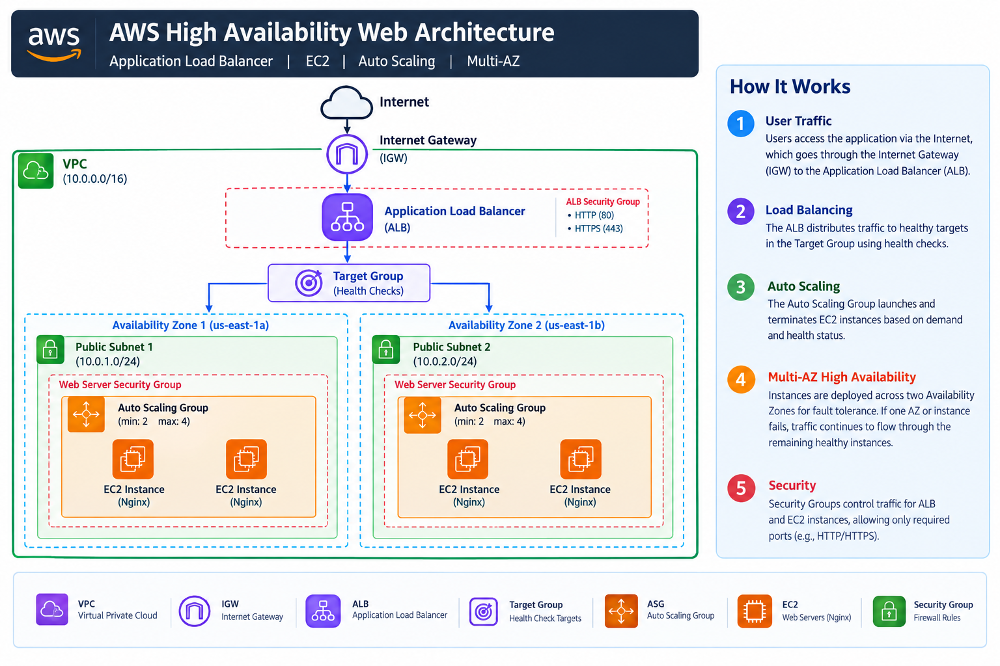
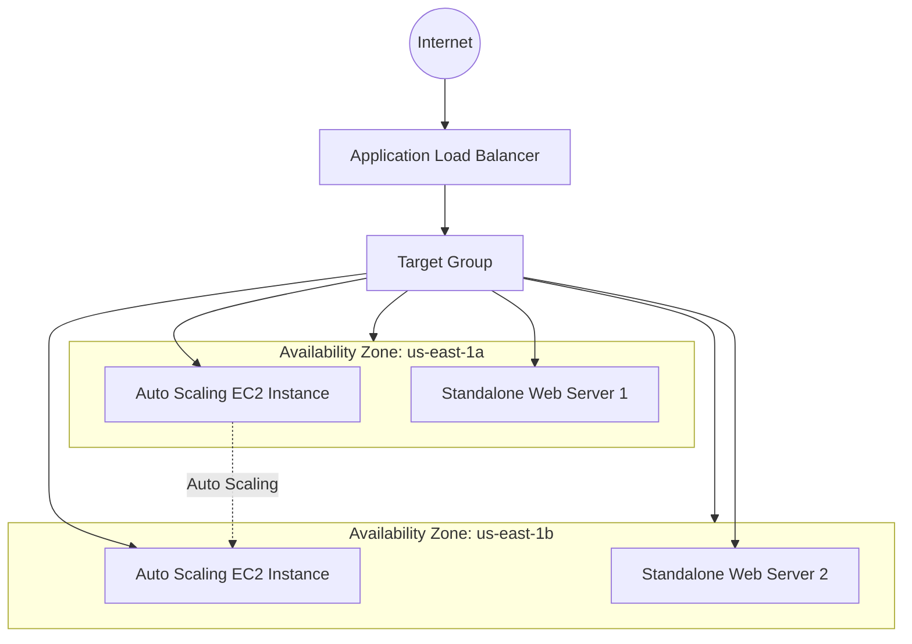

# AWS High Availability Web Architecture

## Overview

This project demonstrates a highly available and scalable web application architecture on AWS using an Application Load Balancer, EC2, Auto Scaling, and multiple Availability Zones.

The environment was built from scratch to demonstrate load balancing, health checks, automatic instance replacement, and horizontal scaling.

## Architecture

- Amazon VPC
- Two Availability Zones
- Two public subnets
- Internet Gateway
- Application Load Balancer
- Target Group
- EC2 web servers running Nginx
- Auto Scaling Group
- EC2 Launch Template
- Security Groups
- EC2 User Data

## Architecture Diagram



## Architecture Flow



## AWS Configuration

### VPC

- VPC: `project3-vpc`
- CIDR: `10.0.0.0/16`

### Availability Zones

The application was deployed across two Availability Zones:

- `us-east-1a`
- `us-east-1b`

### Subnets

Two subnets were created, one in each Availability Zone.

Both subnets use a public route through the Internet Gateway.

### Internet Gateway

- Name: `project3-igw`

The Internet Gateway provides internet connectivity for the public subnets.

### Security Groups

#### ALB Security Group

`project3-alb-sg`

Inbound:

- HTTP (80) from `0.0.0.0/0`

#### EC2 Security Group

`project3-ec2-sg`

Inbound:

- HTTP (80) from the ALB security group
- SSH (22) from the administrator's IP

This restricts web traffic to requests originating from the Application Load Balancer.

### Web Servers

Nginx was installed on the EC2 instances.

Each standalone web server was configured with a different response to demonstrate load balancing:

- Web Server 1: `Hello from Project 3 - Web Server 1`
- Web Server 2: `Hello from Project 3 - Web Server 2`

### Application Load Balancer

The Application Load Balancer distributes incoming HTTP requests across healthy targets in the Target Group.

Health checks are used to determine whether an instance is available to receive traffic.

### Auto Scaling Group

- Name: `project3-web-asg`
- Minimum capacity: 2
- Desired capacity: 2
- Maximum capacity: 4
- Multiple Availability Zones enabled
- Existing Target Group attached

### Launch Template

- Name: `project3-web-template`
- Ubuntu Server 24.04 LTS
- Instance type: `t3.micro`
- Security group: `project3-ec2-sg`
- User Data used to automatically install and configure Nginx

## User Data

```bash
#!/bin/bash

apt update -y
apt install nginx -y

systemctl enable nginx
systemctl start nginx

echo "Hello from Project 3 - Auto Scaling Web Server" > /var/www/html/index.html 
```

## Testing

1. Load Balancing Test

The ALB DNS endpoint was accessed repeatedly.

Requests were distributed between the healthy web servers, demonstrating ALB traffic distribution.

2. High Availability Test

One web server was stopped.

The Target Group detected the instance as unhealthy while the other healthy server continued serving traffic through the ALB.

The stopped instance was started again and returned to a healthy state.

3. Auto Scaling Self-Healing Test

An EC2 instance managed by the Auto Scaling Group was manually terminated.

The Auto Scaling Group automatically launched a replacement instance.

The replacement instance:

Received a public IPv4 address
Executed the User Data script
Installed Nginx
Registered with the Target Group
Passed the ALB health check

4. Scale-Out Test

The Auto Scaling Group desired capacity was temporarily increased:

2 → 4

AWS automatically launched additional EC2 instances.

The new instances successfully joined the Target Group and became healthy.

The desired capacity was then returned to 2.

Key Concepts Demonstrated
AWS VPC networking
Multi-AZ architecture
Application Load Balancing
EC2
Auto Scaling Groups
Launch Templates
Security Groups
Health Checks
Automatic instance replacement
Horizontal scaling
EC2 User Data
Nginx
High Availability

## Lessons Learned:

During implementation, the initial Auto Scaling instances failed ALB health checks.

The instances did not receive public IPv4 addresses, and the subnets did not have automatic public IPv4 assignment enabled.

Because the User Data script required access to Ubuntu package repositories to install Nginx, the instances could not complete their initialization.

Enabling public IPv4 assignment for the subnets and replacing the affected instances resolved the issue.

This demonstrated the relationship between subnet networking, internet connectivity, EC2 initialization, and load balancer health checks.

## Future Improvements
Move application instances into private subnets
Use a NAT Gateway for outbound internet access
Add CloudWatch monitoring and alarms
Configure dynamic Auto Scaling policies
Add HTTPS using ACM
Add Route 53 DNS
Deploy the infrastructure using Terraform
Add CI/CD automation
